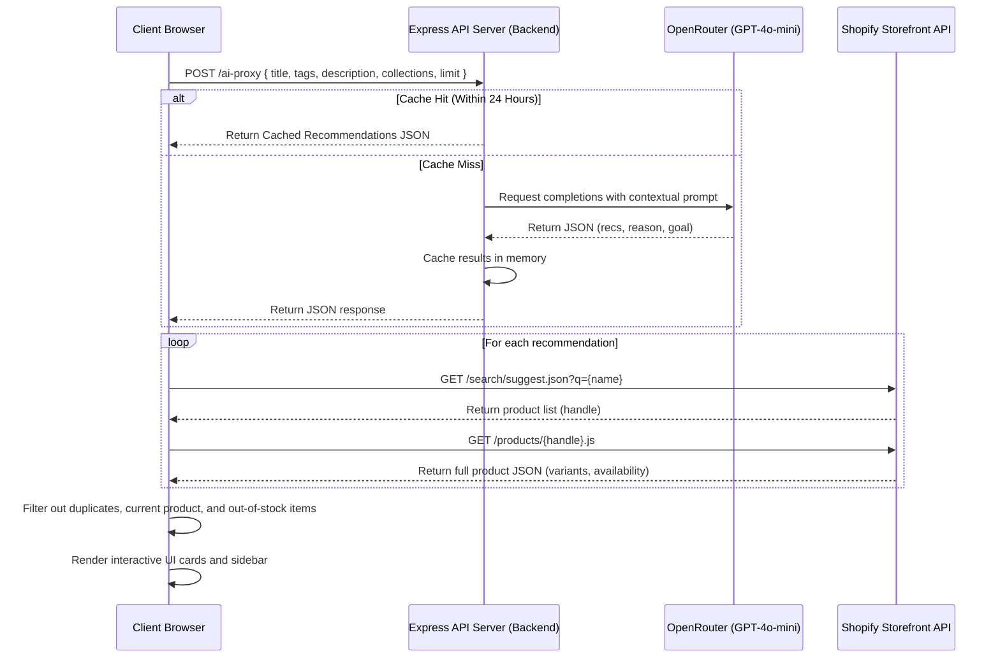

# AI-Powered Bundle Builder for Gummies & Sports Nutrition

An interactive, AI-driven product recommendation and bundling system integrated into a Shopify Dawn theme. This solution suggests complementary health, sports nutrition, and wellness supplements based on the product currently being viewed, recalculates prices with active bundle discounts in real-time, handles variant selection, and adds items directly to the cart using the Shopify AJAX Cart API.

---

## 1. Project Features

### 🌟 Core Features
- **AI Recommendation Section**: A custom-styled Shopify Liquid section (`AI Recommended Bundle`) that automatically displays on product detail pages.
- **Smart Product Matching**: Resolves AI-suggested categories/products into actual in-store Shopify products using the Predictive Search API and filters out out-of-stock items or the currently viewed product.
- **Inline Variant Picker**: Fetches full product data (via `/products/{handle}.js`) to render dropdown variant selectors for products with multiple sizes or flavors.
- **Seamless Cart Integration**: Uses Shopify's AJAX Cart API to add individual items or the entire bundle to the cart and triggers Dawn's native cart drawer (or notification modal) to slide open dynamically.
- **Fallback Support**: Gracefully displays popular items from a merchant-selected collection if the AI proxy fails or cannot find matching products.

### 🚀 Bonus Challenges Implemented
- **AI Goal Detection & Badging**: The AI analyzes the viewed product's description, tags, and collections to detect the user's primary fitness/wellness goal (e.g., *Muscle Growth*, *Sleep & Relaxation*, *Immunity*). A glowing pill badge is rendered at the top of the section with customized color-scheme gradients.
- **Interactive Bundle Pricing & 10% Discount**: Dynamically recalculates subtotals, discount savings, and totals in the sidebar as items are checked/unchecked or variant dropdowns change. Silently applies the configured discount code (e.g., `BUNDLE10`) to the session before cart checkout.
- **Admin Analytics Dashboard**: An analytics tracker logs bundle views, clicks, stack additions, and conversion rates to `localStorage`. When viewed inside the Shopify Theme Customizer (`Shopify.designMode`), a beautiful charcoal admin panel appears showing live interaction metrics.

---

## 2. Tech Stack & Project Structure

- **Frontend**: Shopify Liquid, CSS3 (Vanilla), JavaScript (ES6+), Shopify AJAX Cart API, Shopify Predictive Search.
- **Backend**: Node.js, Express, OpenRouter API (GPT-4o-mini), Axios/OpenAI Client.

### Directory Structure
```text
shopify-ai-bundle-builder/
├── assets/
│   ├── ai-bundle-builder.css   # Clean glassmorphic styling, animations, and layouts
│   └── ai-bundle-builder.js    # Multi-variant logic, AJAX Cart integrations, analytics
├── layout/
│   └── theme.liquid            # Shopify storefront layout linking stylesheet
├── sections/
│   └── ai-bundle-builder.liquid# Custom Liquid section file with settings schema
├── templates/
│   └── product.json            # Configures layout position of the bundle builder section
├── server.js                   # Node Express server with caching & OpenAI completion
├── package.json                # Project dependencies and metadata
└── README.md                   # Setup and usage documentation
```

---

## 3. Setup & Installation Instructions

### Prerequisites
- Node.js (v18+)
- Shopify CLI (v3+)

### A. Backend Setup (AI Proxy Server)
1. Navigate to the root directory and install dependencies:
   ```bash
   npm install
   ```
2. Create a `.env` file in the root and add your OpenRouter/OpenAI API Key:
   ```env
   OPENAI_API_KEY=your-api-key-here
   PORT=3000
   ```
3. Start the local server:
   ```bash
   npm start
   ```
   The backend should start on `http://localhost:3000`.

*Note: In production, host the Node server on a cloud provider like Render or Heroku, and configure your live URL in `assets/ai-bundle-builder.js`.*

### B. Frontend Setup (Shopify Theme)
1. Authenticate with your Shopify store using the CLI:
   ```bash
   npx shopify login --store x0c0jv-1b.myshopify.com
   ```
2. Sync theme files with the store using theme push:
   ```bash
   npx shopify theme push --theme <theme-id>
   ```
3. Open the Shopify Theme Customizer (`https://admin.shopify.com/store/x0c0jv-1b/themes/<theme-id>/editor`).
4. Navigate to the Product page template, add the **AI Bundle Builder** section, configure settings (e.g. Title, Rec count, Discount code, Fallback collection), and hit **Save**.

---

## 4. AI Recommendation Workflow



---

## 5. Theme Customization Settings

Inside the Shopify Theme Editor, you can customize the following settings under the **AI Bundle Builder** section:
- **Enable Section (Checkbox)**: Toggle the widget ON or OFF.
- **Section Title (Text)**: Customize the heading (e.g., "AI Recommended Bundle", "Complete Your Stack").
- **Number of Recommendations (Select)**: Limit the recommendations to 3, 4, or 5 products.
- **Fallback Collection (Collection Picker)**: Choose a fallback collection to display if the AI is unable to fetch recommendations.
- **Discount Code (Text)**: Define the discount code to apply at checkout (default: `BUNDLE10`).
- **Discount Percentage (Range)**: Define the discount rate (0% to 30%, default: 10%).
- **Enable AI Goal Badging (Checkbox)**: Toggle the dynamic wellness goal pill badge.
- **Show Admin Analytics Dashboard (Checkbox)**: Show or hide the interaction stats panel (only visible in design preview mode).

---

## 6. Technical Assumptions
- **Product Names**: Product recommendations from the AI use generic health supplement terms (e.g., "Creatine", "Whey Protein"). The Predictive Search API is assumed to find relevant matches if names overlap with actual store products.
- **Discount Logic**: Store discount codes matching the schema settings (e.g. `BUNDLE10` configured in Shopify Admin) must exist in the Shopify Store settings for the automatic discount application to checkout to proceed.
- **AJAX Drawer**: The theme is assumed to be running Shopify Dawn v15+ where the class name `cart-drawer` or `cart-notification` is accessible globally in the DOM to update elements.
